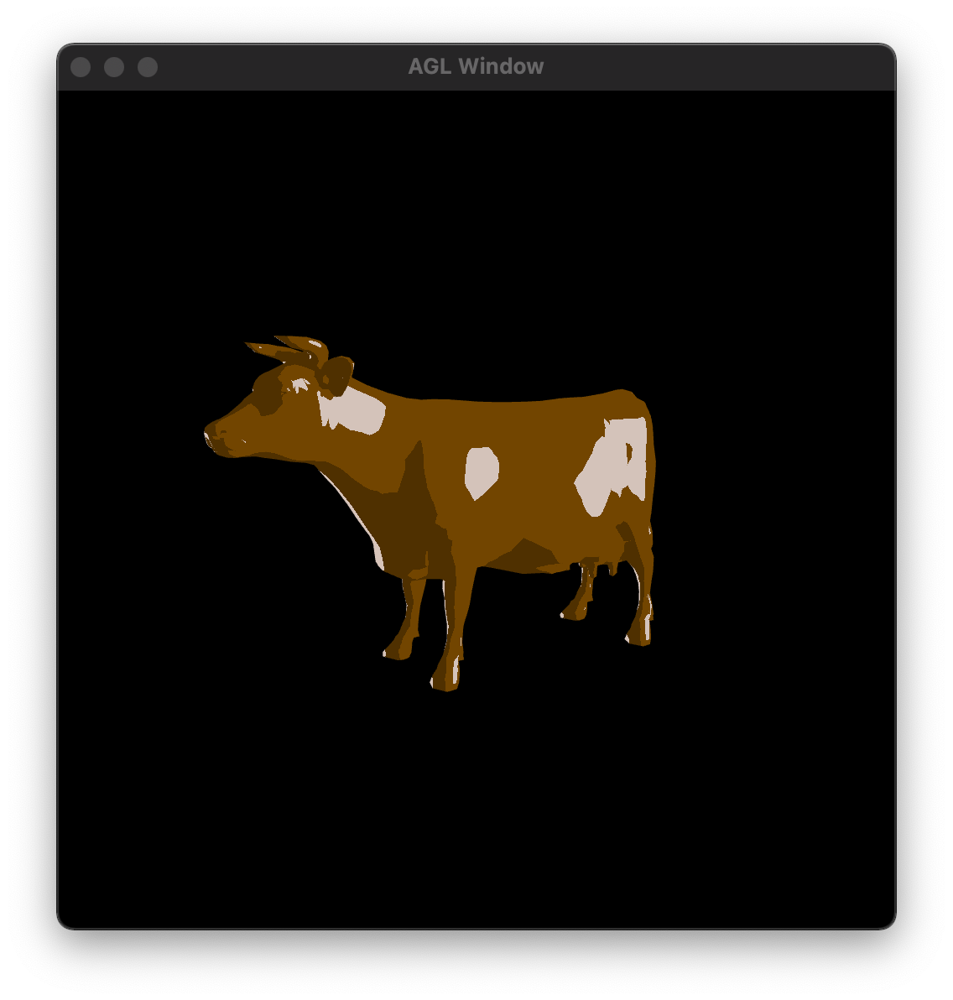

# mesh-viewer

Implements a simple PLY viewer



## How to build

*Windows*

Open git bash to the directory containing this repository.

```
mesh-viewer $ mkdir build
mesh-viewer $ cd build
mesh-viewer/build $ cmake ..
mesh-viewer/build $ start mesh-viewer.sln
```

Your solution file should contain two projects: `mesh-viewer` and `test-ply-mesh`.
To run from the git bash command shell, 

```
mesh-viewer/build $ ../bin/Debug/test-ply-mesh.exe
mesh-viewer/build $ ../bin/Debug/mesh-viewer.exe
```

*macOS*

Open terminal to the directory containing this repository.

```
mesh-viewer $ mkdir build
mesh-viewer $ cd build
mesh-viewer/build $ cmake ..
mesh-viewer/build $ make
```

To run each program from build, you would type

```
mesh-viewer/build $ ../bin/mesh-viewer
```

## Demo of basic features

# Camera movement

https://user-images.githubusercontent.com/112534115/227413682-4358e67b-4370-4724-a405-7c1694eb92c7.mp4

# Read Models from Directory

https://user-images.githubusercontent.com/112534115/227413779-12b0bfbe-8fe6-4922-98d6-b16166eae6c6.mp4

# Normal Shader

https://user-images.githubusercontent.com/112534115/227413797-63938c84-2f8b-4788-b770-13e4ffd3e2c9.mp4

# Gouraud Shader

https://user-images.githubusercontent.com/112534115/227413805-ae92df4f-114c-4e25-9fdc-b57ba565c7cf.mp4

# Phong Shader

https://user-images.githubusercontent.com/112534115/227413826-e0b35779-ebd6-45c5-9aa9-d31eb9df5e0e.mp4

## Unique features

# Wobbly Shader

https://user-images.githubusercontent.com/112534115/227413861-d51bec51-f8a8-47c2-bba2-d29d74ee64e2.mp4

# Toon Shader

https://user-images.githubusercontent.com/112534115/227413872-c8b0dd03-1b40-4c87-b26e-275326a931f4.mp4
